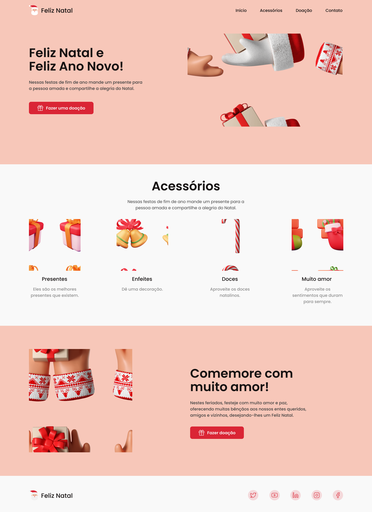

  <a href="#-tecnologias">Tecnologias</a>&nbsp;&nbsp;&nbsp;|&nbsp;&nbsp;&nbsp;
  <a href="#-projeto">Projeto</a>&nbsp;&nbsp;&nbsp;|&nbsp;&nbsp;&nbsp;
  <a href="#-layout">Layout</a>&nbsp;&nbsp;&nbsp;

## 🚀 Tecnologias

Este projeto foi desenvolvido com as seguintes tecnologias:

- HTML
- CSS
- JavaScript

Bibliotecas

- [Google Fonts](https://fonts.google.com/)
- [ScrollRevel](https://scrollrevealjs.org)

Utilitários

- [IconMoon](https://icomoon.io/app/#/select)

## 💻 Projeto

Página no formato One Page, responsiva, no tema natalino. Também pode ser usada em diversos tipos de micro, pequena e média empresas. 
Contém as seguintes seções: Header, Navigation, Home, Acessórios, Doação, Contato e Footer.

## 🔖 Layout

O layout do projeto foi baseado no desafio 16 do @iuricode para treinamento de habilidades com HTML5 e CSS3.

Você pode visualizar o layout do projeto original através [desse link](https://www.figma.com/file/Yb9IBH56g7T1hdIyZ3BMNO/Desafios---Codel%C3%A2ndia?node-id=39341%3A687) (o meu está modificado). É necessário ter conta no [Figma](https://figma.com) para acessá-lo.

<h5 align="center"><a href="https://projeto-de-natal-desafio16.vercel.app/#home">ACESSE AQUI O PROJETO FINAL</a></h5>

---

Feito com ❤️ por Rakel Moreira!
